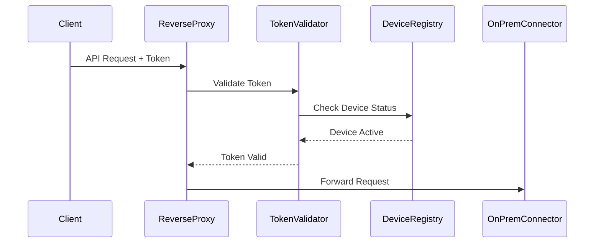

# On-Premise Cloud Connector: Technical Documentation

## Table of Contents
1. [Authentication and Authorization Flow](#authentication-and-authorization-flow)
2. [Device Registration Process](#device-registration-process)
3. [Token Management](#token-management)
4. [Security Implementation](#security-implementation)
5. [Data Flow and Communication](#data-flow-and-communication)
6. [API Endpoints and Services](#api-endpoints-and-services)

## Authentication and Authorization Flow

### Token-Based Authentication
The system implements a robust JWT (JSON Web Token) based authentication mechanism:

1. **Token Generation**:
   - When a device registers, the `TokenManager` generates a signed JWT
   - Token structure:
   ```json
   {
     "device_id": "<unique_device_identifier>",
     "iat": "<issued_at_timestamp>",
     "exp": "<expiration_timestamp>",
     "metadata": {
       "url": "http://onprem-connector:8002",
       "description": "Device Description"
     }
   }
   ```

2. **Token Validation**:
   - Every request is validated through the reverse proxy
   - Validation checks:
     - Token signature verification
     - Expiration time check
     - Device ID existence in registry
     - Token revocation status

3. **Token Renewal**:
   - Automatic token renewal process when token approaches expiration
   - Grace period implementation to prevent service interruption

### mTLS Implementation
The system uses mutual TLS (mTLS) for an additional layer of security:

1. **Certificate Exchange**:
   - Device presents client certificate during registration
   - Cloud services validate certificate against trusted CA
   - Bidirectional certificate validation ensures mutual authentication

2. **Certificate Management**:
   - Automated certificate rotation
   - Certificate revocation handling
   - Integration with existing PKI infrastructure

## Device Registration Process

### Initial Registration Flow

1. **Device Initialization**:
```python
# Device registration request structure
registration_request = {
    "device_id": "unique-device-id",
    "metadata": {
        "url": "http://device-endpoint:port",
        "description": "Device description",
        "capabilities": ["feature1", "feature2"]
    },
    "certificate": "<device_certificate_pem>"
}
```

2. **Registration Steps**:
   a. Device sends registration request to `/api/register`
   b. Registry service validates request format and device certificate
   c. `TokenManager` creates device entry and generates token
   d. Device receives token and stores it securely

3. **Registration Response**:
```json
{
    "status": "success",
    "token": "<jwt_token>",
    "expires_at": "<timestamp>",
    "device_id": "<device_id>",
    "cloud_endpoints": {
        "pub_sub": "wss://cloud-pubsub:8883",
        "api": "https://api-endpoint:443"
    }
}
```

### Device Deregistration Process

1. **Deregistration Flow**:
```python
# Deregistration endpoint
@app.post("/api/deregister/{device_id}")
async def deregister_device(device_id: str):
    try:
        # Validate token and permissions
        if not token_manager.validate_token(request.headers["Authorization"]):
            raise HTTPException(status_code=401)
            
        # Remove device from registry
        token_manager.revoke_device(device_id)
        
        # Cleanup associated resources
        await cleanup_device_resources(device_id)
        
        return {"status": "success", "message": "Device deregistered"}
    except Exception as e:
        log.error(f"Deregistration failed: {str(e)}")
        raise HTTPException(status_code=500)
```

## Token Management

### TokenManager Implementation

```python
class TokenManager:
    def __init__(self, secret_key: str, token_expiry_hours: int = 24):
        self.secret_key = secret_key
        self.token_expiry_hours = token_expiry_hours
        self.registered_devices = {}
        
    def register_device(self, device_id: str, metadata: dict) -> str:
        """Register a device and generate token"""
        token = self._generate_token(device_id, metadata)
        self.registered_devices[device_id] = {
            "token": token,
            "metadata": metadata,
            "last_seen": datetime.utcnow(),
            "status": "active"
        }
        return token
        
    def validate_token(self, token: str) -> bool:
        """Validate token and update last seen timestamp"""
        try:
            payload = jwt.decode(token, self.secret_key, algorithms=["HS256"])
            device_id = payload["device_id"]
            
            if device_id not in self.registered_devices:
                return False
                
            self.registered_devices[device_id]["last_seen"] = datetime.utcnow()
            return True
        except jwt.InvalidTokenError:
            return False
```

## Security Implementation

### Request Flow Security

1. **Incoming Request Processing**:


2. **Security Headers**:
```python
# Security header configuration
security_headers = {
    "X-Content-Type-Options": "nosniff",
    "X-Frame-Options": "DENY",
    "X-XSS-Protection": "1; mode=block",
    "Strict-Transport-Security": "max-age=31536000; includeSubDomains"
}
```

## Data Flow and Communication

### Large Payload Handling

1. **Chunked Transfer Implementation**:
```python
async def handle_large_payload(request):
    # Configure chunked transfer
    chunk_size = 8192  # 8KB chunks
    
    async with aiohttp.ClientSession() as session:
        async with session.post(
            target_url,
            data=request.stream(),
            headers={
                "Transfer-Encoding": "chunked",
                "Authorization": f"Bearer {device_token}"
            },
            chunk_size=chunk_size
        ) as response:
            return await response.json()
```

2. **Data Integrity Checks**:
```python
class ChunkedDataHandler:
    def __init__(self):
        self.chunks = []
        self.checksum = hashlib.sha256()
        
    def process_chunk(self, chunk: bytes):
        self.chunks.append(chunk)
        self.checksum.update(chunk)
        
    def validate_payload(self, expected_checksum: str) -> bool:
        return self.checksum.hexdigest() == expected_checksum
```

## API Endpoints and Services

### Core Endpoints

1. **Device Management**:
```python
# Device registration
POST /api/register
Content-Type: application/json
{
    "device_id": string,
    "metadata": object
}

# Device deregistration
POST /api/deregister/{device_id}
Authorization: Bearer <token>

# Device status
GET /api/devices/{device_id}/status
Authorization: Bearer <token>
```

2. **Data Publishing**:
```python
# Publish device data
POST /api/publish/{device_id}
Authorization: Bearer <token>
Transfer-Encoding: chunked
Content-Type: application/json
{
    "data_type": string,
    "payload": object,
    "timestamp": string
}
```

This documentation provides a comprehensive overview of the system's authentication, authorization, and data handling mechanisms. The implementation ensures secure device registration, efficient token management, and robust data transfer capabilities while maintaining high security standards through mTLS and JWT-based authentication. 